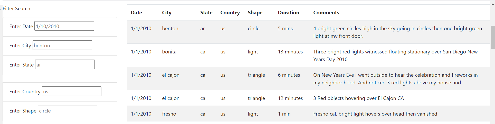
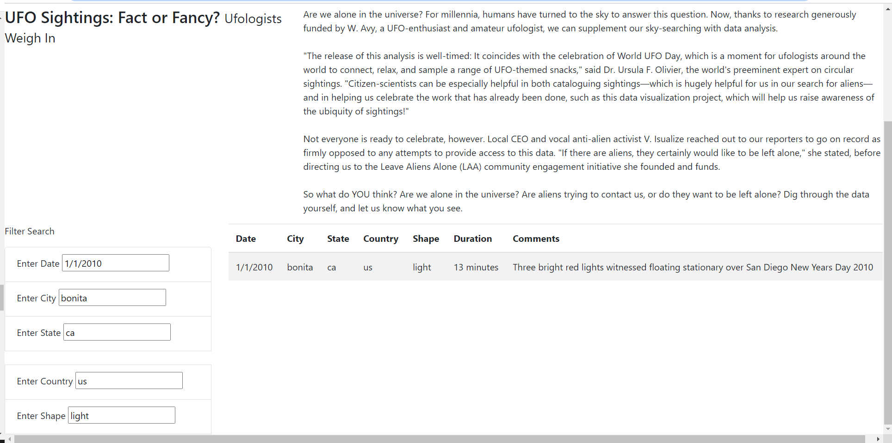

# UFOs

## Purpose
This project organizes the data in a manner that is searchable based on location, date, and, shape by using JavaScript, HTML, and Bootstrap to display the information.

## Search Function
When you first view the page, the search filter auto populates some place holder information, and the table displays the entire dataset. 

Once you enter the search parameters you'll see the desired result. 

You can search based on date of the UFO sighting, the location of the sighting: City, State, and Country, and various descriptions of shape of the UFO. 

## Summary

The dataset provided is a little over 100 data points from two countries: United States and Canada. It would benefit the users to provide a drop down list of available dates, states, cities, countries, and shapes to search from, rather than testing shapes that are not within the dataset to realize those shapes do not exist. The search parameter also are case sensitive, in the event the user enters the United States as US, rather than us, it will not yield any search results. Lower case us is not the conventional search method. As a data analyst, I would consider cleaning up the data and correct punctuation of the summaries prior to making the website live to have a more polished look. 